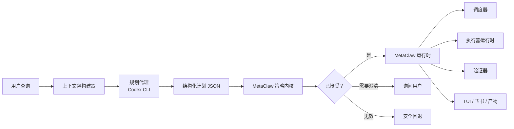

# MetaClaw 规划代理 + 策略内核架构

日期：2026-07-01

## 摘要

MetaClaw 应当停止将用户意图解析、任务路由、恢复决策、优先级处理和执行器选择分散到众多小型启发式逻辑与服务分支中。

目标架构为：

```text
Codex CLI / 规划代理 = 语义大脑
MetaClaw 策略内核     = 确定性操作系统内核
MetaClaw 运行时       = 调度器、执行器运行、验证层、交付层
```

Codex CLI 能够比类正则的分支判断做出更高质量的语义决策，尤其适用于以下模糊请求：

- "你刚才回答了一半，继续完成。"
- "继续刚才那个。"
- "这个任务是不是还没跑完？"
- "基于刚才的结果再扩展一下。"

但 Codex CLI 绝不能直接修改 MetaClaw 运行时状态。它应当返回一个严格结构化的计划。MetaClaw 根据当前状态与策略验证该计划，然后执行实际的状态转换、调度、执行、验证和交付。

## 问题

当前架构已具备正确的组件，但边界模糊：

- 部分语义决策由 LLM 路由完成。
- 部分决策由解析器或正则提示完成。
- 部分任务恢复行为位于 `TaskResumePlanner`。
- 部分任务状态行为位于 `TaskRuntimeService`。
- 部分调度行为位于 `SchedulerEngine`。
- 部分直接回复行为位于 `ConversationRuntimeService`。
- 部分飞书行为依赖于输出解析和会话快照。

结果是难以推理：

- 本应仅提供依据的规则可能意外成为动作。
- 本应使用上下文的语义决策可能被回退逻辑覆盖。
- "继续" 可能表示会话延续、任务延续、阻塞任务恢复或后续工作。
- 优先级、抢占和执行器路由分散在多个层级。
- 代码中有过多各自合理的局部分支，但整个系统感觉不一致。

用户体验因此受损，因为用户无法预测 MetaClaw 何时会直接回答、创建任务、恢复任务或请求澄清。

## 设计原则

MetaClaw 应当将语义判断与状态权限分离。

规划代理回答：

- 用户想要什么？
- 哪些先前的上下文相关？
- 这是直接回答、任务控制、持久化工作还是澄清？
- 如果引用了任务，是哪个任务以及为什么？
- 哪个执行器应当处理？
- 优先级是什么？
- 应当使用什么计划或验收标准？

策略内核回答：

- 引用的任务是否存在？
- 此状态转换是否合法？
- 此请求能否抢占当前任务？
- 不确认是否安全？
- 已完成的任务是否应当分叉为后续任务而非恢复？
- 阻塞的任务是否应当保持阻塞直到缺失材料出现？
- 此执行器能否现在运行？
- 哪些状态变更必须持久化？

运行时回答：

- 我们如何排队工作？
- 我们如何构建上下文？
- 我们如何调用执行器？
- 我们如何验证结果？
- 我们如何交付进度、最终回答、产物和预览链接？

## 目标架构



## 层级职责

### 1. 规划代理

规划代理是一个强大的通用代理，初期为 Codex CLI。

它应当接收一个包含以下信息的结构化提示：

- 用户查询。
- 当前会话焦点。
- 当前任务焦点。
- 最近的会话轮次。
- 最近的任务摘要。
- 运行中的任务。
- 就绪任务。
- 停放任务。
- 阻塞任务。
- 最近完成的任务。
- 执行器配置文件。
- 安全和策略提示。

它返回严格的 JSON 计划。它不写入文件、不修改 SQLite、不启动执行器、不发送飞书消息。

### 2. 策略内核

策略内核是确定性的 TypeScript。

它应当验证规划代理输出：

- 模式验证。
- 置信度阈值。
- 任务存在性。
- 状态转换合法性。
- 抢占策略。
- 确认策略。
- 重复任务预防。
- 已完成任务后续策略。
- 阻塞任务恢复策略。
- 执行器可用性。

内核是唯一被允许将计划转换为运行时状态变更的层级。

### 3. 运行时

运行时仍由 MetaClaw 所有：

- `TaskEngine` 拥有任务状态机。
- `SchedulerEngine` 拥有队列、优先级、抢占和空闲恢复。
- `SessionExecutionCoordinator` 拥有上下文准备、路由、执行器调用、验证和交付。
- `ExecutionRuntime` 拥有适配器调用。
- `VerificationAndDeliveryService` 拥有验收、产物和阻塞反馈。
- 网关和飞书交付仍为后端职责。

## 计划 JSON 契约

规划代理应当返回如下 JSON：

```json
{
  "intent": "direct_reply",
  "confidence": 0.86,
  "reason": "用户是在要求继续最近的解释，而不是恢复一个持久化任务。",
  "target": {
    "taskId": null,
    "contextKind": "conversation",
    "reason": "最新的会话轮次就是未完成的话题。"
  },
  "execution": {
    "shouldCreateTask": false,
    "shouldDispatchExecutor": true,
    "selectedExecutor": "codex-cli",
    "priority": "normal",
    "canPreempt": false,
    "requiresVerification": false,
    "canModifyFiles": false
  },
  "taskControl": {
    "kind": "none",
    "scope": null
  },
  "plan": {
    "summary": "使用最近的会话上下文继续上次的解释。",
    "steps": [],
    "acceptanceCriteria": []
  },
  "ambiguities": [],
  "clarificationQuestion": null,
  "risk": {
    "level": "low",
    "reasons": []
  }
}
```

允许的 `intent` 值：

- `direct_reply`（直接回复）
- `task_control`（任务控制）
- `durable_task`（持久化任务）
- `executor_dispatch`（执行器调度）
- `clarification`（澄清）

允许的 `taskControl.kind` 值：

- `none`（无）
- `status_query`（状态查询）
- `clear_tasks`（清除任务）
- `resume_task`（恢复任务）
- `recover_blocked`（恢复阻塞任务）
- `last_task_continuation`（上次任务延续）

允许的优先级：

- `normal`（普通）
- `high`（高）
- `urgent`（紧急）

## 策略内核验证

内核应在需要时拒绝或重写计划。

示例：

- 如果 `target.taskId` 不存在，请求澄清或安全回退。
- 如果选择了已完成的任务进行恢复，则转换为后续任务。
- 如果阻塞任务缺少恢复证据，保持阻塞状态。
- 如果 `canModifyFiles=true` 但用户仅提出概念性问题，降级为直接回复。
- 如果 `canPreempt=true` 但优先级不够高，则排队而非抢占。
- 如果 `selectedExecutor` 不可用，选择备用执行器或询问。
- 如果置信度低且动作会修改任务状态，请求澄清。

这是 MetaClaw 保持可靠性的地方。

## 用户查询分类

MetaClaw 仍然需要分类，但它们应当是语义分类，而非关键词桶。

### 直接回复

当用户想要即时回答且不需要持久化状态时使用。

信号：

- 解释。
- 澄清。
- 概念性问题。
- 关于当前会话的后续问题。
- "继续" 指的是最近的回答，而非持久化任务。

系统行为：

- 不创建任务。
- 回忆最近的会话上下文。
- 发送到默认执行器进行回答生成。
- 记录交互。
- 显示 MetaClaw 和执行器里程碑。

### 任务控制

当用户想要检查或修改现有 MetaClaw 任务状态时使用。

信号：

- 询问什么在运行或阻塞。
- 恢复、解除阻塞、取消、清除或检查任务。
- 引用显式任务 ID。
- 询问之前的任务是否完成。

系统行为：

- 除非需要后续，否则不创建新任务。
- 验证目标任务。
- 应用合法的状态转换。
- 更新运行时状态。

### 持久化任务

当用户需要持久化、执行、产物、恢复或后续查找的工作时使用。

信号：

- 生成报告。
- 修改文件。
- 运行测试。
- 分析附加材料。
- 研究并产出产物。
- 带有验收标准的多步骤工作。

系统行为：

- 创建或绑定任务。
- 构建上下文包。
- 路由执行器。
- 调度执行。
- 验证输出。
- 记录产物和交付。

### 澄清

当意图模糊且错误的动作会创建状态、修改文件、恢复错误任务或向外部发送数据时使用。

系统行为：

- 提出简短的问题。
- 不创建任务。
- 不调度执行器。
- 不修改任务状态。

## 为什么不让 Codex CLI 拥有一切？

因为调度是一个状态机问题。

Codex CLI 能够很好地推理用户意图，但它不应当是以下操作的唯一权威：

- 任务状态转换。
- 队列排序。
- 运行中任务的抢占。
- 阻塞恢复。
- 重复任务预防。
- 产物持久化。
- 飞书交付。
- 审计日志。
- 权限边界。

如果 Codex CLI 直接拥有这些操作，MetaClaw 将变得难以审计和调试。系统可能创建重复任务、恢复错误任务、跳过阻塞状态检查，或发送不完整的飞书回复。

更好的分工是：

```text
Codex 决定应当发生什么。
MetaClaw 决定什么是被允许的。
MetaClaw 执行状态变更。
```

## 迁移计划

### 阶段 1：引入规划代理契约

- 添加 `PlanningAgent` 接口。
- 实现一个基于 Codex CLI 的规划器。
- 返回严格的 JSON。
- 添加模式验证。
- 保留现有路由器作为回退。

验收标准：

- 现有测试仍然通过。
- 规划器输出可在调试日志中检查。
- 规划器不修改运行时状态。

### 阶段 2：集中化策略内核

- 创建 `PolicyKernel` 或等价服务。
- 将置信度门控、状态转换验证、任务绑定验证、抢占规则和阻塞恢复门控移入其中。
- 使规则提示仅作为依据。

验收标准：

- 没有正则或规则提示能直接创建/恢复/清除任务。
- 每个修改状态的计划都通过一个验证器。
- 无效计划产生澄清或安全回退。

### 阶段 3：替换分散的意图分支

- 收缩 `SessionIntentApplicationService`。
- 收缩 `TaskResumePlanner`。
- 收缩语义路由中的临时回退分支。
- 保持确定性的任务执行和交付不变。

验收标准：

- 直接回复、任务控制、持久化任务和澄清都共享相同的计划验证路径。
- "继续" 场景通过上下文而非关键词进行测试。

### 阶段 4：改善可观测性

- 在 TUI 和飞书进度中显示规划代理决策。
- 显示 MetaClaw 接受、重写或拒绝计划的原因。
- 持久化规划决策用于审计和回归测试。

验收标准：

- 用户可以看到哪个执行器在回答或执行。
- 用户可以看到 MetaClaw 选择了直接回复、任务控制还是持久化任务。
- 用户可以看到任务为何被排队、恢复、阻塞或澄清。

## 测试策略

添加四个层级的测试。

### 规划契约测试

- Codex 输出可解析。
- 无效 JSON 安全失败。
- 缺失字段安全失败。
- 低置信度的修改动作请求澄清。

### 策略内核测试

- 未知任务 ID 被拒绝。
- 已完成任务的恢复变为后续任务。
- 无恢复证据的阻塞任务保持阻塞。
- 运行中的任务不能被复制。
- 不安全的外部动作需要确认或警告策略。

### 会话验收测试

- "你刚才回答了一半，继续完成" 继续最新的会话上下文。
- "继续刚才那个任务" 恢复最后聚焦的持久化任务。
- "继续上次完成的报告，做英文版" 分叉一个后续任务。
- "网络好了，继续" 恢复相关的阻塞任务。
- 模糊的 "继续那个" 在没有强近期上下文时请求澄清。

### 交付测试

- TUI 显示规划决策和执行器。
- 飞书显示 MetaClaw 里程碑和执行器里程碑。
- 飞书在进度之后发送最终回答。
- 产物保持由后端交付，而非执行器交付。

## 风险

### 规划器越权

Codex CLI 可能提出过于宽泛的动作。

缓解措施：

- 严格的模式。
- 策略内核验证。
- 置信度门控。
- 规划器不修改状态。

### 延迟

为每个意图调用 Codex CLI 可能增加延迟。

缓解措施：

- 对显式斜杠命令保持快速的确定性处理。
- 缓存近期规划上下文。
- 使用保守的超时。
- 当规划器超时时，修改动作回退到澄清。

### 可调试性

LLM 决策可能难以复现。

缓解措施：

- 持久化规划器输入摘要和输出 JSON。
- 添加黄金测试。
- 在进度 UI 中显示决策原因。

### 过度分类的成本

过多分类可能让用户困惑。

缓解措施：

- 保持用户可见的分类简单：回答、控制任务、执行任务、澄清。
- 保持内部字段用于策略，而非 UI 复杂性。

## 推荐的终态

MetaClaw 应当拥有一条语义规划路径和一条确定性策略路径。

```text
用户输入
  -> 构建规划上下文
  -> Codex CLI 返回结构化计划
  -> MetaClaw 策略内核验证或重写
  -> MetaClaw 运行时执行
  -> TUI/飞书显示决策、执行器、进度、最终结果
```

这既保留了通用代理的自然语言理解能力，又不放弃任务操作系统的可靠性。
