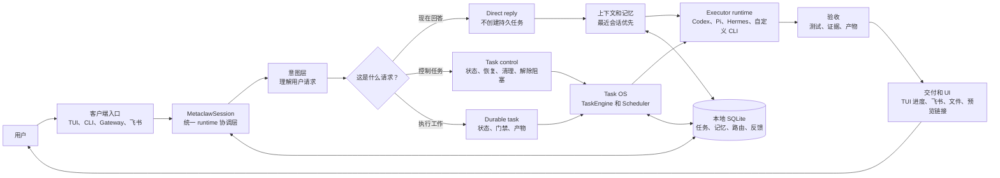
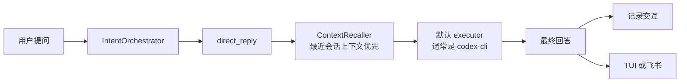
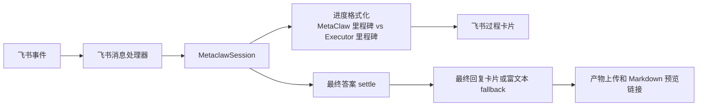

# MetaClaw

[English](README.md) | [中文](README.zh-CN.md)

MetaClaw 是一个本地优先的 AI Task OS。它把自然语言需求变成可持久化、可检索、可调度、可验收的任务，让 AI 工作不再只是“回答这一轮”，而是可以跨中断继续执行、恢复上下文、路由到合适的执行器，并把最终产物交付到用户真正查看的地方。

它适合需要 AI Agent 长时间可靠工作的团队：任务有状态机，记忆有边界，执行有路由，复杂任务有拆解和验收，文件产物有记录，飞书交付有后端，真实端到端烟测可以验证用户路径是否跑通。

## 核心能力

- 持久任务状态：created、ready、running、parked、blocked、done、archived、cancelled。
- 中断后通过 resume context 继续，不从头重做。
- 系统空闲时自动恢复满足条件的挂起任务。
- 用语义优先级判断可执行任务的调度顺序，不靠关键词匹配。
- 当前强制单一活跃顶层任务，避免路由层重构期间出现多任务并存的歧义。
- 通过本地 SQLite FTS 索引检索历史任务，并结合混合召回恢复相关上下文。
- 将复杂任务规划为 work units、验收标准和聚合规则。
- 按任务意图、执行器能力和执行边界自动路由。
- 已实现并测试 Agentic Loop 核心层：聚合执行器结果、检查证据、发现不满足验收的部分并反馈重试。
- 只自动注入明确适用的记忆和偏好；不确定召回默认跳过，飞书和无人值守执行器不会等待确认。
- 生成文件自动记录为任务产物。
- 飞书回复、文件同步和 Markdown 在线预览由后端统一处理。
- 本地 Gateway 支持多个终端连接同一个 MetaClaw runtime。
- 交互式 TUI 会展示用户提交内容、当前任务、路由状态、执行准备、执行器进度和最终任务结果，让用户能看到核心执行路径，而不是只看到最后答案。
- TUI 输入框支持常见终端编辑行为：空格、多行输入、左右光标移动、按光标位置 Backspace 删除前一个字符，以及终端发出原始 Delete escape sequence 时的向前删除。
- 提供 `npm run smoke:metaclaw` 真实端到端烟测，实际启动 MetaClaw CLI、执行器、文件产物捕获和回归检查。

## 核心架构

MetaClaw 是面向任务的系统，而不是纯 session agent。普通 agent session 主要回答当前这一轮。MetaClaw 会判断用户输入应该保持为轻量对话、控制已有任务，还是变成一个可以调度、阻塞、恢复、检索、验收、交付和审计的持久任务。



主干逻辑很简单：所有输入进入同一个 runtime，先做语义裁决，然后走三条路径之一。短回答保持轻量；任务控制只改变已有任务状态；真正要执行的工作变成持久任务，进入调度、恢复、验收和交付链路。

### 普通问答路径



这条路径仍然是语义驱动。用户说“继续”或“你刚才回答了一半”，MetaClaw 会优先从最近会话上下文理解主题，而不是靠硬编码关键词，也不会让无关旧任务覆盖当前问题。

### 持久任务路径


这就是 Task OS 路径。任务状态、恢复上下文、调度、产物捕获和验收都在这里发生。

当前公开入口有一个明确约束：同一时间只接纳一个活跃顶层任务。普通问答、澄清、状态查询、清理任务命令，以及明确指向当前活跃任务本身的请求仍然允许通过。新的无关顶层任务会被拒绝，并给出可见提示，直到当前任务完成或取消。这样可以在 ExecutionPolicy 路由和 fallback 行为加固期间保持用户路径可预测。

### 飞书和进度展示路径



飞书进度会刻意区分 MetaClaw 里程碑和具体 executor 里程碑。用户能看到当前是 MetaClaw 在路由、召回上下文、调度，还是具体 executor 正在执行。

conversation / task 的边界很重要：

- Conversation：即时回答，不创建持久任务。普通问答仍会走语义上下文召回。用户说“继续”或“刚才回答了一半”时，MetaClaw 会把最近会话上下文作为最强证据，再考虑更旧的相似历史。
- Task control：查看或改变已有任务状态。适合“当前在跑什么”“继续那个任务”“清空阻塞任务”。
- Durable task：创建或继续需要执行、持久化、产物、恢复、调度或后续检索的工作。

当前 direct reply 路径是显式的：MetaClaw 先展示意图理解，再召回最近对话上下文，然后把回答交给选中的 executor。飞书和 TUI 会区分 `MetaClaw` 里程碑和具体 `Executor: <name>` 里程碑，让用户知道当前是路由器、调度器还是执行器在工作。飞书最终回复会等待 direct reply 输出 settle 后再发送，避免只有过程卡片而没有最终答案。

[MetaClaw Task OS 架构与策略升级方案](docs/plans/2026-06-14-metaclaw-task-os-architecture-strategy-upgrade.md) 中的本轮主线已经进入代码：任务检索索引、混合任务召回、执行策略规划、多执行器 work units、汇总验收和 Agentic Loop 核心层都已实现并有针对性测试覆盖。Executor Discovery、远程 Registry 和大规模多客户端 Gateway 扩展仍然不是本轮重点。

重要边界：Agentic Loop 已作为核心架构层实现并测试；当前交互式/script session 默认执行路径仍沿用 session runtime，只有明确接入策略/编排循环的功能路径才会调用它。这样可以在增强复杂任务验收能力的同时，保持现有用户路径稳定。

## 当前执行器

| 执行器 | 命令 | 适合任务 | 安装要求 |
| --- | --- | --- | --- |
| Codex CLI | `codex` | 仓库修改、测试、确定性实现、带 patch 的代码审查 | 安装并登录 OpenAI Codex CLI |
| Pi Agent | `pi` | 调研、报告生成、多步骤信息综合、agentic CLI 工作流 | 安装 `@earendil-works/pi-coding-agent` 并完成登录 |
| Hermes Agent | `hermes` | 调研、多工具编排、记忆/网关/助手工作流 | 安装并登录 Hermes |

默认运行时命令是 `codex`，内部表示为 `codex-cli` executor profile。当前路由路径基于 ExecutionPolicy：MetaClaw 将请求分类为 capability class，从显式意图和可用 profile 中选择 primary executor，记录 fallback 候选，然后通过执行 runtime 运行。Pi Agent 和 Hermes Agent 在已安装时可以作为调研类工作的候选或被选用。DeepSeek TUI、Claude Code 和 OpenClaw 仍然可用于显式本地配置，但除非被选为默认 executor，否则不会进入默认注册表。

## 前提条件

必须具备：

- Node.js `>=20.0.0`。
- npm。
- Git。
- Unix-like shell 环境，优先支持 macOS 和 Linux；Windows 用户推荐使用 WSL2，这是当前支持的可靠安装路径。
- `better-sqlite3` 的原生编译工具链。

推荐安装编译工具：

```bash
# macOS
xcode-select --install

# Ubuntu / Debian
sudo apt-get update
sudo apt-get install -y build-essential python3 make g++
```

执行器前提：

- 使用默认 `codex-cli`：安装并登录 OpenAI Codex CLI。
- 如果希望调研类工作可路由到默认执行器之外：安装并登录 Pi Agent 或 Hermes Agent。

飞书集成前提：

- 飞书应用具备消息接收和发送权限。
- 将 app secret 放入环境变量，例如 `FEISHU_APP_SECRET`。
- 使用双向飞书对话时，订阅 `im.message.receive_v1`。
- 如需回传文件，开启文件上传和发送消息能力。
- 推荐使用 WebSocket 事件投递，因为它不需要公网回调 URL。
- 公网反代或内网穿透仅在 webhook 模式或外部 Markdown 预览链接时需要。

Markdown 在线预览前提：

- `integrations.markdown_preview.enabled: true`。
- 如果用户不在宿主机上打开链接，需要配置可访问的 `public_base_url`。

## 安装

大多数用户按这个顺序安装和验证：

```bash
git clone https://github.com/IFOSR/metaclaw.git
cd metaclaw
./setup.sh
metaclaw --help
npm run smoke:metaclaw
```

看到 `metaclaw --help` 能打印 CLI 帮助，并且 `npm run smoke:metaclaw` 最后输出下面内容，才说明安装后真实用户路径可用：

```text
MetaClaw real task smoke passed.
Artifact: /tmp/.../smoke-result.md
```

`setup.sh` 会安装 MetaClaw 本身、构建 CLI、执行 `npm link`、生成 `~/.metaclaw/config.yaml`，并自动检测当前系统里的 Executor。

在交互式终端里，它会展示检测到的 Executor 列表，让用户选择要接入哪几个 Executor，并选择哪个作为默认 Executor。如果选择了缺失但支持自动安装的 Executor，setup 可以直接安装。没有任何 Executor 可用时，默认 fallback 是安装 Codex CLI：

```bash
npm install -g @openai/codex
```

如果 setup 过程中刚安装了 Codex CLI，先打开一次 Codex 并完成登录，再运行真实任务：

```bash
codex
```

安装核验清单：

- `node --version` 是 `>=20`。
- `./setup.sh` 最后显示“安装完成”。
- `~/.metaclaw/config.yaml` 已生成。
- 新开一个 shell 后，`metaclaw --help` 可用。
- 默认 executor 命令可用，例如 `codex --help`。
- `npm run smoke:metaclaw` 通过，并打印生成的 artifact 路径。

setup 可选参数：

```bash
# 默认不覆盖已有 ~/.metaclaw/config.yaml
METACLAW_OVERWRITE_CONFIG=false ./setup.sh

# 强制重写 ~/.metaclaw/config.yaml
METACLAW_OVERWRITE_CONFIG=true ./setup.sh

# 只构建，不执行 npm link
METACLAW_INSTALL_MODE=none ./setup.sh

# 没有 Executor 时也不自动安装 Codex CLI
METACLAW_INSTALL_CODEX=false ./setup.sh

# 强制使用非交互默认行为
METACLAW_SETUP_INTERACTIVE=false ./setup.sh
```

手动安装 fallback：

```bash
npm install
npm run build
npm link
```

检查 CLI：

```bash
metaclaw --help
```

如果 setup 后提示找不到 `metaclaw` 命令，先新开一个 shell，让 `PATH` 重新加载 npm global link。如果仍然找不到，重新执行手动安装 fallback，并用 `npm config get prefix` 检查 npm global bin 目录是否在 `PATH` 中。

## Windows 安装

Windows 用户推荐使用 WSL2 + Ubuntu。这样可以提供 MetaClaw 当前需要的 Unix-like shell、原生编译工具链、socket、进程行为和 executor 兼容性。

先在 Windows PowerShell 中安装 WSL2：

```powershell
wsl --install -d Ubuntu
```

如果系统提示重启，重启后打开 Ubuntu，在 WSL 内安装依赖：

```bash
sudo apt-get update
sudo apt-get install -y git curl build-essential python3 make g++

curl -fsSL https://deb.nodesource.com/setup_20.x | sudo -E bash -
sudo apt-get install -y nodejs

node --version
npm --version
git --version
```

然后在 WSL Ubuntu shell 内安装并验证 MetaClaw：

```bash
git clone https://github.com/IFOSR/metaclaw.git
cd metaclaw
./setup.sh
metaclaw --help
npm run smoke:metaclaw
```

如果 setup 过程中安装了 Codex CLI，先在 WSL 里打开一次 Codex 并完成登录，再执行真实任务：

```bash
codex
```

Windows 安装核验清单：

- 在 WSL Ubuntu 里运行 MetaClaw 命令，不要在 Windows PowerShell 里直接运行。
- 仓库建议放在 WSL 文件系统，例如 `~/metaclaw`，不要放在 `/mnt/c/...`，这样文件和 SQLite 性能更稳定。
- `node --version` 是 `>=20`。
- 新开一个 WSL shell 后，`metaclaw --help` 可用。
- 默认 executor 在 WSL 内可用，例如 `codex --help`。
- `npm run smoke:metaclaw` 输出 `MetaClaw real task smoke passed.`

Windows 原生 PowerShell 不是当前推荐的主要运行环境。高级用户可以手动尝试 Node.js 20、Git、Visual Studio Build Tools、`npm install`、`npm run build` 和 `node dist/index.js`，但 `setup.sh`、`metaclaw.sh`、Unix socket Gateway 行为以及下游 executor CLI 可能和 Linux/macOS 不一致。需要稳定安装和推广给用户时，请使用 WSL2。

## 安装执行器

MetaClaw 不内置下游执行器 CLI。你需要自己安装要使用的执行器，并确保命令在 `PATH` 中。

### 注册自定义 Executor

Executor 是 MetaClaw 可以路由任务的运行时工人。一个已注册 Executor 现在包含两层信息：

- 路由画像：适用领域、能力、风险等级、历史成功率、输入/输出类型和适用场景。
- 运行绑定：本机命令、非交互参数、安装检测命令和可选项目地址。

如果不确定具体该填什么，使用问答式注册向导：

```bash
/executor register wizard
```

向导会依次询问 Executor 名称、是否从项目地址推断、运行命令、非交互参数、安装检测命令、适用领域和能力。如果提供 GitHub 项目地址，MetaClaw 会尝试从 `package.json` 或 README 示例推断 CLI 信息；如果无法可靠推断，会自动回到手动填写。

也可以一次性注册：

```bash
/executor register research-bot \
  --command research-bot \
  --args "run --prompt {prompt}" \
  --check "research-bot --version" \
  --project-url https://github.com/example/research-bot \
  --domains research,reporting \
  --capabilities research,report_generation
```

`{prompt}` 会被替换为任务提示词。如果 `--args` 不包含 `{prompt}`，MetaClaw 会把 prompt 追加为最后一个参数。调度到自定义 Executor 前，MetaClaw 会先执行配置的检测命令；检测失败时会把该 Executor 标记为 `unavailable`，并回退默认 Executor。

Executor 扩展契约：

必需的路由字段：

- `name`：稳定的 Executor 名称，例如 `research-bot` 或 `finance-research-agent`。
- `domains`：适用领域，例如 `research`、`finance`、`software`。
- `capabilities`：能力标签，例如 `research`、`report_generation`、`multi_tool`、`coding`、`tests`。
- `availability`：`available` 或 `unavailable`；安装检测失败时 MetaClaw 会更新该状态。

建议的路由字段：

- `inputTypes`：支持输入类型，例如 `text`、`files`、`image`。
- `outputTypes`：输出类型，例如 `markdown`、`report`、`code`、`patch`、`json`。
- `primaryUseCases`：适合路由给它的典型任务。
- `avoidUseCases`：不适合路由给它的任务。
- `riskLevel`：`low`、`medium` 或 `high`。
- `historicalSuccess`：历史成功分数，后续可随任务结果影响排序。
- `projectUrl`：项目仓库或文档地址。

必需的运行绑定：

- `runtimeCommand`：本机 `PATH` 上可执行的命令，例如 `research-bot`。
- `runtimeArgs`：非交互运行参数，例如 `["run", "--prompt", "{prompt}"]`。
- `runtimeCheckCommand`：安装或可用性检测命令，例如 `research-bot --version`。

运行行为要求：

- 必须能非交互运行，不能等待人工输入。
- 必须能通过 `{prompt}` 或最后一个参数接收完整任务提示词。
- 最终答案应输出到 stdout。
- 失败时应返回非 0 exit code，或在 stderr 输出明确错误。
- 长任务应周期性输出进度，避免被 idle watchdog 判断为卡死。
- 文件产物应写入 prompt 中指定的任务输出目录。
- 飞书交付、文件上传和预览链接生成应由 MetaClaw 后端完成；Executor 应产出本地文件，不应自己直接调用飞书 API。

可选高级 Adapter 接口：

- `execute(input)`：用结构化上下文执行任务。
- `isAvailable()`：检测 Executor 是否可运行。
- `abort()`：取消正在执行的任务。
- `installSkill(pkg)`、`updateSkill(pkg)`、`disableSkill(target)`、`deprecateSkill(target)`：支持 Executor 自己的 Skill 生命周期管理。

常用管理命令：

```bash
/executor list
/executor register wizard
/executor unregister <name>
/executor route <任务描述>
/executor route-feedback
```

### Codex CLI

安装并登录 Codex CLI 后验证：

```bash
which codex
codex --help
```

默认配置：

```yaml
executor:
  command: codex
  timeout: 300
  max_duration: 3600
```

`timeout` 表示连续无输出 watchdog，不是固定墙钟总时长限制。只要 executor 仍在 stdout 或 stderr 输出内容，MetaClaw 就会续期，不会因为运行时间长而杀掉仍活跃的进程。`max_duration` 仅保留用于兼容旧配置，不再用于终止活跃 executor。

### Pi Agent

安装 Pi coding agent CLI 并完成登录：

```bash
npm install -g @earendil-works/pi-coding-agent
which pi
pi --help
```

MetaClaw 调用方式：

```bash
pi -p "<prompt>"
```

Pi 调研类工作流通常比 CLI 编码任务执行更久。即使全局执行器配置更短，MetaClaw 也会自动给 `pi-agent` 至少 `timeout: 900` 秒的连续无输出等待时间。活跃的 Pi 进程不会再因为硬总时长上限被终止。

如需将 Pi 设为默认执行器：

```yaml
executor:
  command: pi
```

### Hermes Agent

安装并登录 Hermes，然后验证：

```bash
which hermes
hermes --help
```

MetaClaw 调用方式：

```bash
hermes --oneshot "<prompt>" --yolo --accept-hooks
```

`--oneshot` 让 Hermes 以脚本/headless 模式运行，`--yolo` 跳过危险命令确认，`--accept-hooks` 自动接受未见过的 hooks。当前 single-executor 调研路由不会默认让 Pi Agent 和 Hermes Agent 竞速。MetaClaw 会根据 ExecutionPolicy 选择一个 primary executor；只有 primary executor 失败时，才按 fallback chain 尝试兜底。复杂 multi-executor 策略仍可以在同一个顶层任务内部，把不同 work unit 分配给不同 executor。

### 已退役的兼容 Adapter

`deepseek-tui`、`claude-code` 和 `openclaw` adapter 仍保留在代码里，用于兼容和显式本地配置；但除非把它们显式配置为默认 executor，否则不会进入默认注册表。

```bash
executor:
  command: hermes        # 旧版/手动
  # command: deepseek-tui # 旧版/手动
```

## Executor 与 Skill 的差异

Executor 和 Skill 是生态里的不同层。

Executor 是“谁来干活”。Skill 是“干活时带什么方法、知识和工具规范”。

Executor 更像一个可派发的 Agent runtime：Codex CLI、Pi Agent、Hermes Agent、DeepSeek TUI，或者某个垂直领域本地 Agent。它决定模型、工具链、权限、运行环境、上下文窗口、文件读写能力、非交互执行方式、成本和可靠性边界。

Skill 更像轻量能力包。它描述某一类工作应该怎么做：怎么做期货分析、怎么做代码审查、怎么跑调研流程、怎么输出报告格式。Skill 可以改善某个 Executor 的表现，但不会自动改变这个 Executor 的 runtime、权限、工具或安装状态。

Executor 的优势：

- 增加新的 runtime 边界，包括模型、工具、凭证、权限和命令行行为。
- 让 MetaClaw 可以把任务路由给最适合的执行者。
- 支持不同 Agent 之间的回退、交叉验证和审计。
- 可以接入通用 Skill 无法访问的私有系统或垂直领域系统。

Executor 的代价：

- 安装和配置更重。
- 必须明确非交互运行命令和可用性检测方式。
- 需要处理权限、超时、失败和回退。
- 多个 runtime 行为不一致时，会增加运维复杂度。

Skill 的优势：

- 更轻量，添加速度快。
- 适合沉淀可重复的方法、清单、领域启发和输出规范。
- 能提高同一个 Executor 在特定任务上的一致性。
- 运维成本比新增 runtime 更低。

Skill 的限制：

- 受限于宿主 Executor 的工具、权限、上下文和模型。
- 不能凭空获得不存在的 CLI、私有 API、浏览器能力、文件权限或企业系统集成。
- 通常提升执行质量，而不是扩展 runtime 边界。

当缺失能力来自“需要不同工人或不同 runtime”时，MetaClaw 通过注册 Executor 扩展能力；当已有工人需要更好的流程、领域知识或输出规范时，通过 Skill 扩展能力。

## 运行

```bash
metaclaw
```

交互式 TUI 会在任务执行时保持用户可见性：

- 用户提交的输入会回显到 transcript。
- 输入框状态会显示 `processing`、`running <executor>`、`blocked` 或 `idle`。
- 状态栏会展示当前任务 ID、任务状态和标题。
- 路由和执行过程会展示核心进度，包括理解用户请求、执行策略、上下文召回、执行上下文构建、执行器路由、执行器进度、验收和最终结果。
- MetaClaw 自身的调度/编排里程碑会标为 `【MetaClaw｜...】`；具体执行器的里程碑会标为 `【Executor: <name>｜...】`，执行器进度行也会带上实际 executor 名称，避免把 MetaClaw 的调度动作和真正处理任务的 runtime 混在一起。
- 输入框支持正常终端编辑：空格、多行输入、左右移动光标、Backspace 删除光标前字符，以及原始 Delete escape sequence 的向前删除。

或使用项目脚本：

```bash
./metaclaw.sh start
```

首次启动会创建：

```text
~/.metaclaw/
├── config.yaml
├── metaclaw.db
└── gateway.sock
```

连接已有实例：

```bash
./metaclaw.sh connect
```

运行管理：

```bash
./metaclaw.sh status
./metaclaw.sh logs
./metaclaw.sh logs -f
./metaclaw.sh restart
./metaclaw.sh stop
```

安装或管理用户级 Gateway 服务：

```bash
./metaclaw.sh gateway install
./metaclaw.sh gateway start
./metaclaw.sh gateway status
./metaclaw.sh gateway restart
./metaclaw.sh gateway stop
```

直接 Gateway 模式：

```bash
metaclaw --gateway
metaclaw --connect
```

## 配置

编辑：

```bash
~/.metaclaw/config.yaml
```

示例：

```yaml
version: 1

executor:
  command: codex
  timeout: 300
  max_duration: 3600

orchestration:
  reminder_enabled: true
  reminder_throttle: 300
  top_k_preferences: 5
  blocked_recheck_enabled: true
  blocked_recheck_interval: 60

ui:
  language: zh-CN
  dashboard_on_start: true

notifications:
  feishu:
    enabled: false
    webhook_url: ""
    secret: ""

gateway:
  enabled: true
  platforms:
    feishu:
      enabled: true
      domain: feishu
      connection_mode: websocket
      app_id: ""
      app_secret_env: FEISHU_APP_SECRET
      event_port: 8787
      event_path: /feishu/events
      verification_token: ""
      encrypt_key_env: FEISHU_ENCRYPT_KEY
      home_channel: ""
      access:
        dm_policy: pairing
        allowed_users: []
        group_policy: open
        require_mention: true
      delivery:
        final_markdown_mode: card
        fallback_mode: post
        final_file_fallback: true

integrations:
  markdown_preview:
    enabled: true
    host: 127.0.0.1
    port: 8790
    public_base_url: ""
```

启动前导出飞书密钥：

```bash
export FEISHU_APP_SECRET="your Feishu app secret"
./metaclaw.sh start
```

## 飞书交付和在线预览

MetaClaw 将“文档生成”和“飞书交付”分开处理：

- 执行器只负责把 Markdown 或其他文件写入任务输出目录。
- MetaClaw 将文件记录为 task artifacts。
- 飞书后端把最终答案发回聊天。
- 如果文件上传能力可用，飞书后端会上传任务产物。
- 如果配置了 Markdown Preview，Markdown 产物会附带在线预览链接。
- 投递尝试会写入 `~/.metaclaw/gateway-audit.jsonl`。

执行器不应该直接调用飞书云文档 API。用户说“飞书云文档”或“在线预览”时，MetaClaw 会要求执行器产出本地 Markdown 产物，后端负责飞书同步和预览链接。

飞书进度卡片会明确展示执行链路。MetaClaw 先进行意图解析和执行准备，然后展示 ExecutionPolicy 决策、路由原因，以及真正启动任务的执行器。这样飞书用户不会把意图解析器或策略规划器误认为最终执行器。

最终飞书回复优先使用 Markdown message card。长回复会拆成多张卡片；如果某个卡片 chunk 失败，MetaClaw 会把该 chunk 重试为富文本 post；如果仍有 chunk 无法投递，会上传完整最终答案 Markdown 文件，避免用户只收到半截结果。

访问控制由 Gateway 处理：

- 私聊默认使用 `dm_policy: pairing`。第一个私聊用户会自动通过，后续用户可用 `metaclaw gateway pairing` 审批或撤销。
- 群聊默认使用 `group_policy: open` 和 `require_mention: true`。
- 在飞书聊天里发送 `/sethome` 会把该聊天记录为 `gateway.platforms.feishu.home_channel`。
- 旧版 `integrations.feishu` 配置仍会作为兼容来源读取，但新部署应使用 `gateway.platforms.feishu`。

常用飞书 Gateway 命令：

```bash
metaclaw gateway doctor
metaclaw gateway pairing list
metaclaw gateway pairing approve <open_id>
metaclaw gateway pairing revoke <open_id>
```

默认预览 URL：

```text
http://127.0.0.1:8790/preview/<artifact>
```

如果飞书用户不在宿主机上打开链接，需要暴露 preview 服务并设置：

```yaml
integrations:
  markdown_preview:
    enabled: true
    host: 127.0.0.1
    port: 8790
    public_base_url: https://preview.example.com
```

## 任务工作流

用自然语言创建任务：

```text
> 对比三份合同的风险点，并生成风险矩阵。
```

MetaClaw 会：

1. 判断输入是轻量对话、任务控制，还是持久任务。
2. 创建新任务或定位已有任务。
3. 检索可用的历史任务上下文。
4. 计算语义优先级。
5. 路由到最合适的 executor。
6. 对复杂任务生成 work units 和验收标准。
7. 执行并持续记录进展。
8. 保存结果摘要、文件产物和任务记忆。
9. 给出下一步建议。

常用命令：

```bash
/tasks
/tasks active
/tasks ready
/tasks parked
/tasks blocked
/tasks done

/task <id>
/task <id> pause
/task <id> resume
/task <id> block waiting for customer data
/task <id> unblock
/task <id> unblock /tmp/evidence-v3.pdf
/task <id> cancel
/task <id> done
/task index rebuild
/task index search <query>

/dashboard
/attach [taskId] <file paths...>
/history
/config
/help
/exit
```

## 任务检索和混合召回

MetaClaw 会用本地 SQLite FTS5 建立任务检索索引，让历史工作可以被重新发现。用户不需要记住准确 task id，也可以通过关键词、上下文和关系找回相关任务。

命令：

```bash
/task index rebuild
/task index search 合同 风险 矩阵
```

HybridTaskRetriever 会综合多种信号：

- 当前请求里显式提到的 task id。
- 当前 session 的焦点任务。
- 任务检索索引的全文命中。
- 任务关系。
- 最近活跃任务。
- 反馈和历史执行痕迹。
- 候选集上的语义 rerank。

隐式召回会排除当前任务，避免任务第一次执行时把自己召回成历史记忆。不确定记忆不会被盲目注入；飞书和无人值守 executor 流程不会因为等待记忆确认而卡住。

## 调度和优先级模型

MetaClaw 当前使用单一活跃顶层任务，前面有一个调度器。

- 新任务按紧急度、准备度、连续性收益、下游影响和搁置时间评分。
- 紧急度来自结构化语义判断，不靠关键词匹配。
- 满足条件的 parked 任务会在系统空闲时自动恢复。
- 语义紧急的 parked 任务会排在普通 parked 任务前面。
- 任务池看护会周期性展示 blocked / parked 任务，以及缺失条件或下一步。
- 可恢复的执行器故障会被定时复查；执行器恢复可用后，任务会重新进入调度。
- 材料、权限、授权和访问类阻塞不会自动解除，必须等用户补充输入或显式 unblock。
- 未 ready 的任务不会自动执行。

当一个顶层任务正在运行时，`TaskAdmissionGate` 会拒绝新的无关 durable task，以及针对其他任务的执行请求。它仍允许普通问答、澄清、状态查询、清理任务命令，以及明确指向当前活跃任务的请求。第二个顶层任务的排队、紧急抢占和自动恢复在当前范围内刻意关闭；ADR-0011 把这记录为一个可逆决策。

这样既防止排队任务浪费算力，又保证任务安全。如果 ExecutionPolicy 策略需要，单个已接纳的顶层任务内部仍然可以运行 multi-executor work units。

## Executor 路由

路由现在是策略优先。`IntentOrchestrator` 产出结构化决策，包含单一的 capability class，如 `code_edit`、`research`、`messaging`、`memory_ops`、`office_automation`、`conversation` 或 `general`。`ExecutionPolicyPlanner` 将其转化为 primary executor、候选 executor、fallback chain、风险等级、验证级别、验收标准和策略。

旧版 `ExecutorRouter` 和 `repo_execution`、`research_workflow` 等遗留路由意图名称仍保留作为路由事件、预览和旧调用方的兼容边界。它们不再主导主执行路径，历史成功元数据也不影响当前策略评分。

## 复杂任务策略和 Agentic Loop

MetaClaw 可以把复杂需求表示成执行策略，而不是把整段需求一次性塞给一个 executor。策略规划器会在两种模式之间选择：

- `single_executor`：任务足够集中，一个 executor 可以完成。
- `multi_executor`：任务被拆成多个 work units，每个 unit 有 executor hint、依赖、输入、期望输出类型、风险等级和验收项。

触发复杂策略的信号包括：用户明确要求多 agent 或多视角、任务横跨多个能力域、存在先后阶段依赖、涉及高风险验证、包含多个资源或命中多个相关历史任务。

Agentic Loop 核心流程：

1. `MultiExecutorOrchestrator` 执行 work units，可串行也可并行。
2. `ExecutionAggregator` 汇总各 executor 结果。
3. 检查验收证据：是否满足用户原始需求，patch 是否有测试证据，调研是否有来源，artifact 是否有路径，review 是否有 pass/concerns，是否缺少 work unit，多个结果之间是否冲突。
4. 如果验收通过，输出最终聚合结果。
5. 如果验收有 concerns，把针对性反馈追加回失败的 work units 并重试。
6. 如果达到最大迭代仍未通过，返回 `blocked` 和原因，而不是把未验收的结果交付给用户。

这就是 MetaClaw 对 agentic work 的验收层：executor 返回文本不等于任务完成。核心模块已经实现并有针对性测试覆盖；不同用户入口的接入会分阶段推进，以保持现有 runtime 稳定。

## 记忆和召回审查

MetaClaw 把确认过的偏好、观察、任务记忆卡片、召回事件和学习候选保存在 SQLite 中。

记忆不会被盲目注入。明确适用的记忆会自动应用并留下审计记录；不确定记忆默认跳过，而不是要求用户现场确认。这样飞书和无人值守 executor 流程可以持续推进。

命令：

```bash
/memory
/memory candidates
/memory confirm obs_123 --scope contact --subject Alex
/memory add Alex prefers formal updates with legal copied
/memory search formal
/memory edit <pref_id> --scope project Use tables for outputs
/memory delete <pref_id>
/memory stats
/memory review-policy
```

## 学习循环

MetaClaw 可以把成功任务、失败任务、文件产物和 executor skill 使用情况沉淀成学习候选。

命令：

```bash
/learning candidates
/learning approve <candidate_id> [note]
/learning reject <candidate_id> [reason]
/learning promote <candidate_id>
/learning cards
/learning skills
/learning summary
/learning weekly
```

## 开发

```bash
npm run dev
npm run build
npm test
npm run lint
npm run smoke:metaclaw
```

脚本化烟测：

```bash
cat > /tmp/metaclaw-flow.txt <<'EOF'
Compare the risk points across three contracts and produce a concise table.
/tasks done
EOF

metaclaw --script /tmp/metaclaw-flow.txt
```

`--script` 会逐行执行输入，空行和以 `#` 开头的行会被忽略。

`npm run smoke:metaclaw` 是功能交付前必须优先跑的真实端到端烟测。它会构建 MetaClaw，用隔离的临时 `METACLAW_HOME` 和工作目录启动 `node dist/index.js --script`，提交一个真实任务，让配置的 executor 创建文件产物，并检查产物路径和文件内容。默认 smoke 配置使用 `codex`；要切换执行器和场景，可以运行 `npm run smoke:metaclaw -- --executor pi --scenario python-hello`，或设置 `METACLAW_SMOKE_EXECUTOR=pi METACLAW_SMOKE_SCENARIO=python-hello npm run smoke:metaclaw`。新的 runtime 功能应该通过这条烟测路径；如果不能跑，必须明确说明失败或跳过原因。

针对性测试：

```bash
npm test -- tests/core/executor-router.test.ts
npm test -- tests/core/execution-planning-service.test.ts
npm test -- tests/core/semantic-intent-router.test.ts
npm test -- tests/core/scheduler.test.ts
npm test -- tests/session/task-admission-gate.test.ts
npm test -- tests/execution/execution-runtime.test.ts
npm test -- tests/integrations/feishu-app.test.ts
npm test -- tests/session/scripted-session.test.ts
```

## 目录结构

```text
src/
├── cli/            # CLI 参数解析：--script、--gateway、--connect
├── commands/       # Slash command 路由和命令处理
├── core/           # 路由/意图/执行策略 seam，以及共享基础类型
├── delivery/       # 验收、产物抽取、聚合检查和最终交付准备
├── execution/      # 执行 runtime、fallback chain、多 executor 编排、聚合、进度、workspace、对话 runtime
├── executor/       # Executor adapter，以及 profile/admin/seeder、prompt、skill package
├── gateway/        # 本地 Gateway server/client 和飞书 Gateway runtime
├── guidance/       # 主动引导、任务信号、引导策略和仪表盘编排
├── integrations/   # 外部集成辅助能力，例如 Markdown preview
├── intent/         # 内联资源归一化和非路由意图/材料辅助函数
├── learning/       # 反思、周报、技能治理、晋升门禁和安全扫描
├── memory/         # 记忆捕获、召回、召回审查、偏好、上下文 bundle 和 vault 导出
├── notifications/  # 通知适配器，例如飞书通知
├── routing/        # ExecutionPolicy planner 和正在演进的 routing policy 层
├── session/        # 交互/script/gateway session 协调和持久化
├── storage/        # SQLite migrations 和 repositories
├── task/           # 任务状态机、runtime、调度、恢复规划、排序、语义/embedding 检索
├── tui/            # Ink 终端 UI
└── utils/          # 配置、路径、日志、ID 等通用工具
```

测试按同样分区放在 `tests/<domain>/`。`src/core` 现在刻意保持很窄：只保留 routing / intent / policy seam（如 `IntentOrchestrator`、`ExecutorRouter`、`ExecutionPlanningService`、`ExecutionStrategyPlanner`、`ExecutionPolicy`、`CapabilityClass`、`RuleHintsProvider`、`SemanticIntentRouter`、`task-routing`、`llm-bridge`）以及共享基础类型（`types.ts`、`embedding-provider.ts`）。业务实现应放回对应领域目录，不再回流到 `core`。

## License

MIT
